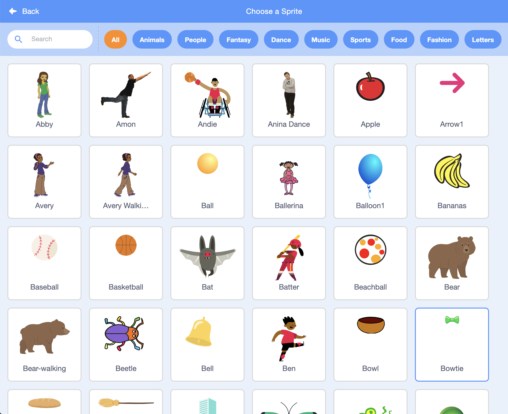
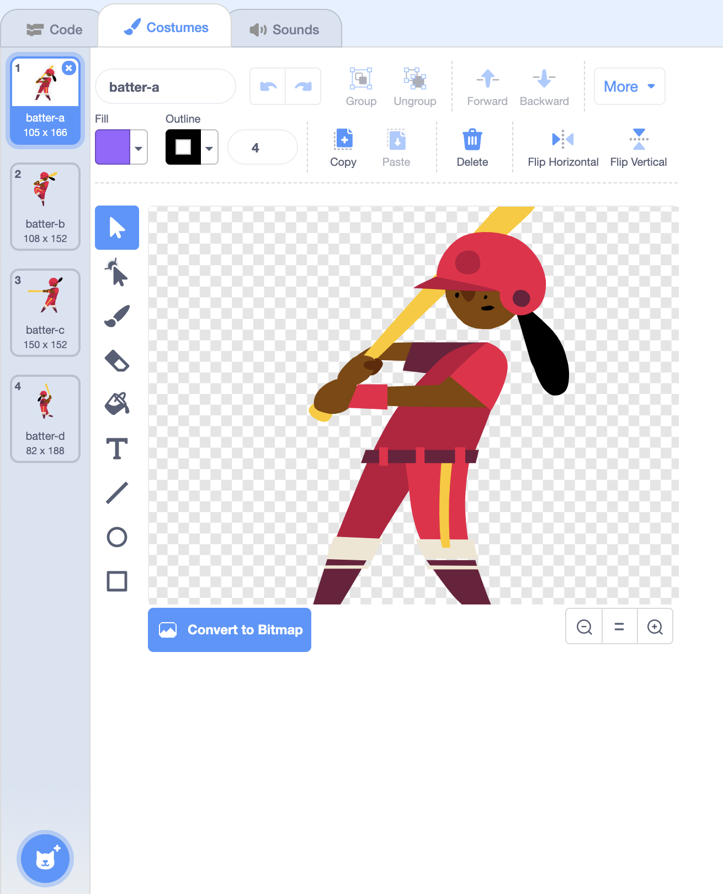
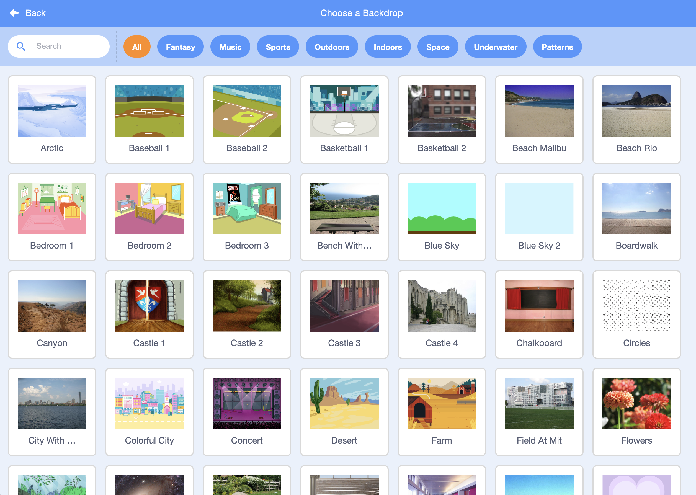

# Scratch Objects

## Sprite

The object that can perform actions. Sprites can be used as characters or objects in your project.  Sprite can have blocks \(scripts\), costumes and sounds. 

### More about Sprite





## Costume

A **costume** is one out of possibly many "frames" or alternate appearances of a [sprite](https://en.scratch-wiki.info/wiki/Sprite). 



## Block \(Script\)

Blocks are puzzle-piece shapes that are used to create code in Scratch. The blocks connect to each other vertically like a jigsaw puzzle, where each data type \(hat, stack, reporter, boolean, or cap\) has its own shape and a specially shaped slot for it to be inserted into, which prevents syntax errors. Series of connected blocks are called scripts.

There are ten categories of blocks: Motion, Looks, Sound, List, Event, Control, Sensing, Operators, Variables, and My Blocks. Only nine of these are shown in the Block Palette.

### More about Block



## Stage

The background of the project. Stage can have blocks \(scripts\), backdrops and sounds.



## Backdrop

One frame of the stage. 



## Backpack

A place where user can share objects \(sprites, backdrops, costumes, sounds and scripts\) between projects. 



## Sounds

Audio objects. 

